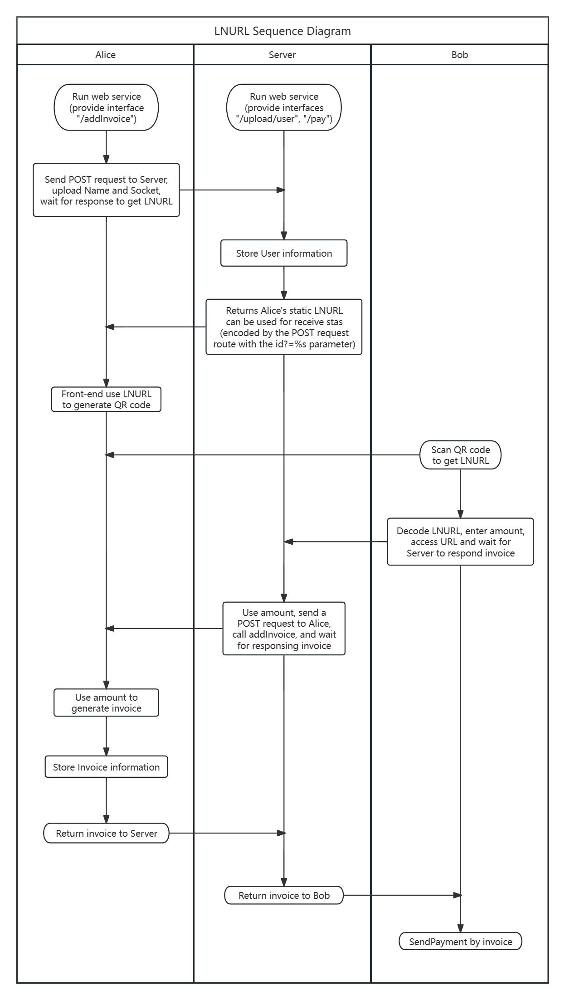

# lnurl-demo

## Design



## Steps

0. Configure the right values in .env

```go
SERVER_DOMAIN_OR_SOCKET="127.0.0.1:9080"
ALICE_RPC_SERVER=""
ALICE_TLS_CERT_PATH=""
ALICE_MACAROON_PATH=""
BOB_RPC_SERVER=""
BOB_TLS_CERT_PATH=""
BOB_MACAROON_PATH=""
```

1. Alice runs service on Phone

```go
api.RouterRunOnPhone()
```

2. Server runs service 

```go
api.RouterRunOnServer()
```

3. Alice uploads info to Server, then gets LNURL

```go
api.UploadUserInfo(name, socket) 
```

4. *(Alice generates QR code, Bob scans QR code)*

- You can try to generate the QR code by `qrc.js` in directory qrc

5. Bob uses LNURL to pay amount of stas

```go
api.PayToLnurl(lnu, amount)
```

6. Bob gets response of transaction hash